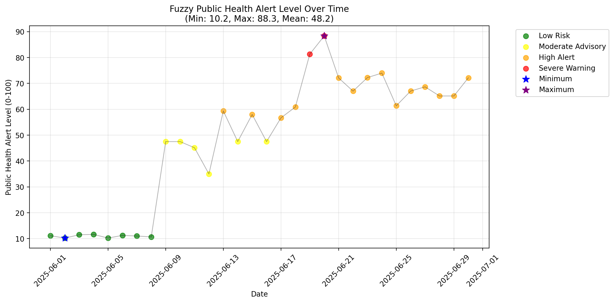

# Fuzzy Air Quality Risk

A Python fuzzy-inference project that combines air pollutants, wind speed, and population vulnerability into a **0–100 alert score**. It exports analysis results, plots membership functions and alert trends, and prints a summary report.

The model uses `scikit-fuzzy` with triangular and trapezoidal membership functions and a rule base covering pollution levels, combined effects, vulnerability, and wind mitigation.

> The default run uses **synthetic demonstration data**. The score and category names are project-defined outputs, not a validated public-health warning service or an official AQI.

## Features

- Five inputs: PM2.5, NO₂, O₃, wind speed, and population vulnerability.
- Four output categories: Low Risk, Moderate Advisory, High Alert, and Severe Warning.
- Reproducible sample generation using random seed `42`.
- CSV analysis through the Python API.
- Three saved visualizations and a CSV of row-level results.
- Terminal statistics and an illustrative comparison with a simplified AQI calculation.

## Getting started

### Requirements

Python 3 and the packages in [requirements.txt](requirements.txt): NumPy, pandas, Matplotlib, scikit-fuzzy, and SciPy.

**NetworkX is also required by scikit-fuzzy's control module**, but is not listed in this repository's requirements file. Install it explicitly as shown below. See the [upstream control-system source](https://github.com/scikit-fuzzy/scikit-fuzzy/blob/master/skfuzzy/control/controlsystem.py).

The repository does not pin dependency versions or specify a tested Python version.

### Install

```sh
git clone https://github.com/beksus/fuzzy-air-quality-risk.git
cd fuzzy-air-quality-risk
python -m venv .venv
```

Activate the environment:

**Windows PowerShell**

```powershell
.\.venv\Scripts\Activate.ps1
```

**macOS / Linux**

```sh
source .venv/bin/activate
```

Install dependencies and run:

```sh
python -m pip install -r requirements.txt networkx
python fuzzy_air_alert.py
```

Use `python3` for environment creation if that is your system's Python 3 command.

The default run generates **30 synthetic daily records for June 1–30, 2025**, calculates alerts, writes files to `output/`, and prints a report. Existing output files with the same names are overwritten.

## Model inputs and outputs

These are the input units and intended ranges defined by the code:

| CSV column | Meaning | Model range | Fuzzy terms |
| --- | --- | --- | --- |
| `pm25` | PM2.5 concentration, μg/m³ | 0–250 | Low, moderate, high, very high |
| `no2` | NO₂ concentration, ppb | 0–200 | Low, moderate, high |
| `o3` | O₃ concentration, ppb | 0–200 | Low, moderate, high |
| `wind_speed` | Wind speed, m/s | 0–20 | Low, medium, high |
| `pvi` | Population Vulnerability Index | 0–10 | Low, medium, high |

The wind and PVI sampling arrays extend slightly beyond their intended upper membership endpoints. Keep custom data within the ranges above.

The rule list contains **20 entries**, including one duplicated NO₂/high-vulnerability rule. Examples include:

- Low values for all three pollutants → Low Risk.
- Very high PM2.5 → Severe Warning.
- Moderate PM2.5 with high vulnerability → High Alert.
- High O₃ with high wind → Moderate Advisory.

Rules can activate together; the final score reflects their combined fuzzy output rather than one hard threshold.

After inference, the numeric score is rounded to two decimals and assigned a category:

| Score | Category |
| --- | --- |
| 0–25 | Low Risk |
| Greater than 25 through 50 | Moderate Advisory |
| Greater than 50 through 75 | High Alert |
| Greater than 75 through 100 | Severe Warning |

These reporting intervals are separate from the overlapping output membership functions.

## Use your own CSV

Prepare a CSV with these columns:

```csv
date,pm25,no2,o3,wind_speed,pvi
2025-06-01,16.5,42.9,15.0,15.5,2.0
```

A `date` column is needed for time-series plotting. The five model inputs must be numeric and use the units above.

Call the existing Python API from a script in the repository root:

```python
from fuzzy_air_alert import run_fuzzy_analysis, generate_report

df = run_fuzzy_analysis(
    input_csv="my_air_quality.csv",
    output_dir="custom_output",
)
df = generate_report(df)

# Save again if you want the AQI comparison columns added by generate_report().
df.to_csv("custom_output/analysis_with_comparison.csv", index=False)
```

The script has no command-line argument parser; passing a CSV filename after `python fuzzy_air_alert.py` does not select that file.

Column names are stripped, lowercased, and normalized by replacing spaces with underscores and removing periods. Missing numeric values are coerced to NaN, then `dropna()` removes rows with missing values in **any column**, including unused columns. Prefer a clean file containing only the required fields.

If the supplied path does not exist, the function falls back to synthetic data.

### Included Kuala Lumpur file

[kuala-lumpur-air-quality.csv](kuala-lumpur-air-quality.csv) contains pollutant columns but lacks `wind_speed` and `pvi`. It is not used by the default run and is not ready for direct analysis.

Before using it, supply suitable wind and vulnerability data, confirm pollutant units and measurement definitions, and prepare the required schema. The repository does not document the file's units or provenance sufficiently to assume its values match the model's concentration inputs.

## Outputs

| File | Contents |
| --- | --- |
| [output/air_quality_complete_analysis.csv](output/air_quality_complete_analysis.csv) | Inputs, fuzzy score, explanatory rule messages, and alert category. |
| [output/membership_functions_complete.png](output/membership_functions_complete.png) | Membership curves for all five inputs and the output. |
| [output/fuzzy_alert_timeseries_complete.png](output/fuzzy_alert_timeseries_complete.png) | Scores over time with category colors and minimum/maximum markers. |
| [output/alert_level_distribution.png](output/alert_level_distribution.png) | Counts by alert category. |

The repository already includes example outputs from the synthetic dataset.



`generate_report()` adds `traditional_aqi` and `aqi_vs_fuzzy_diff` to the returned DataFrame **after** the standard CSV has been written. Those columns are not included in the default saved CSV.

## Project structure

| Path | Purpose |
| --- | --- |
| [fuzzy_air_alert.py](fuzzy_air_alert.py) | Membership functions, rules, sample generation, analysis, plotting, and reporting. |
| [requirements.txt](requirements.txt) | Unpinned Python dependencies; NetworkX needs to be added separately. |
| [kuala-lumpur-air-quality.csv](kuala-lumpur-air-quality.csv) | Additional dataset requiring preparation. |
| [output/](output/) | Committed example results and plots. |
| `.idea/` | IDE configuration. |

## Interpretation and limitations

- **Rule explanations:** `fired_rules` is generated by a small set of separate threshold checks. It is not a complete trace of actual fuzzy-rule activation, and an empty list does not imply that no model rules fired.
- **Rule coverage:** the rules are a subset of possible input combinations. Failed row calculations produce NaN and an error message; empty or entirely failed datasets can also cause plotting failures.
- **AQI comparison:** the report uses a simplified custom calculation on a different scale from the 0–100 fuzzy score. Their raw difference is not an accuracy metric or evidence of model validation.
- **Plot colors:** distribution bars receive colors by sorted category position, which may not match the category colors in the time-series chart.
- **Documentation sources:** comments refer to a PDF specification and guidelines that are not included in the repository.
- **Verification:** no automated tests are included. This README was checked against the source and committed results; the application was not executed during this documentation review.

## License

No license file is currently included in the repository.

